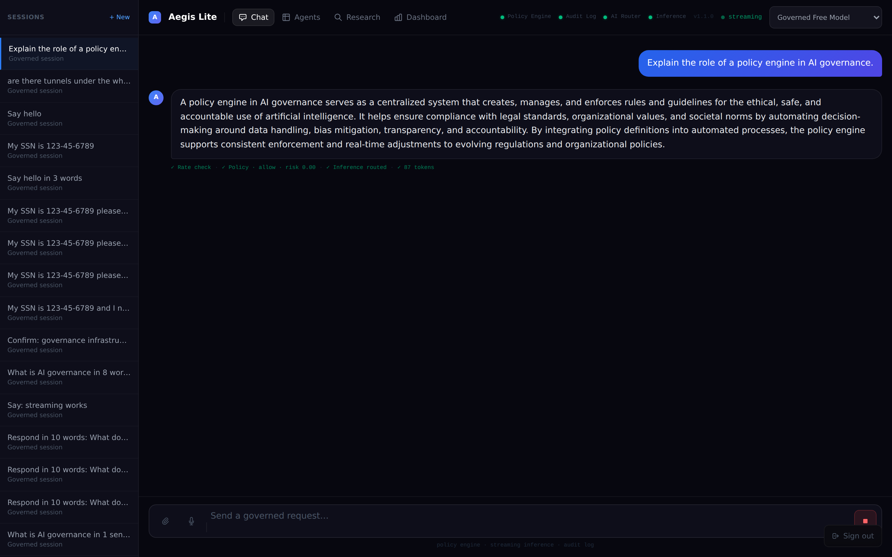
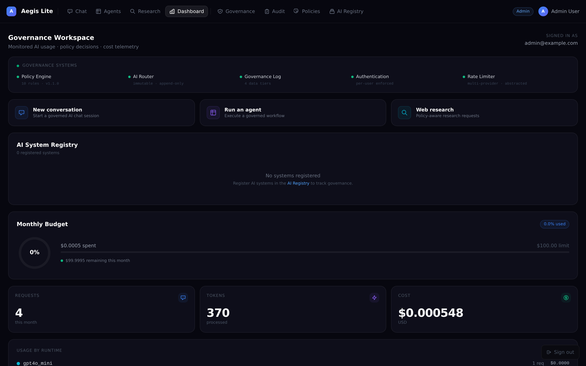
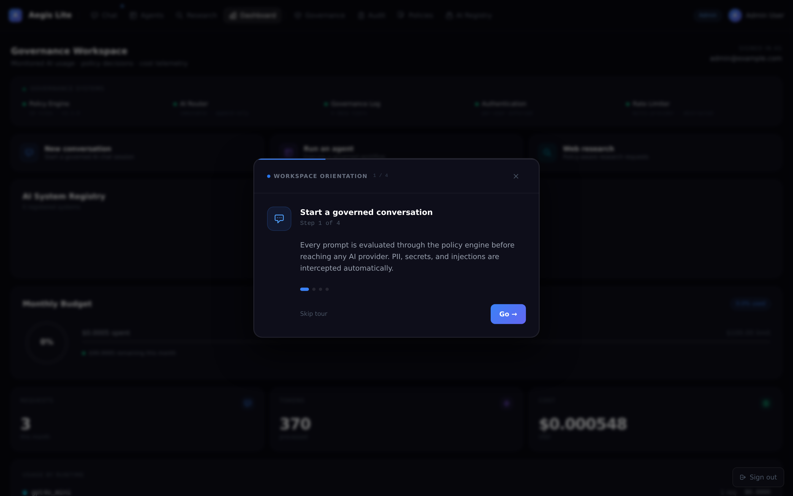
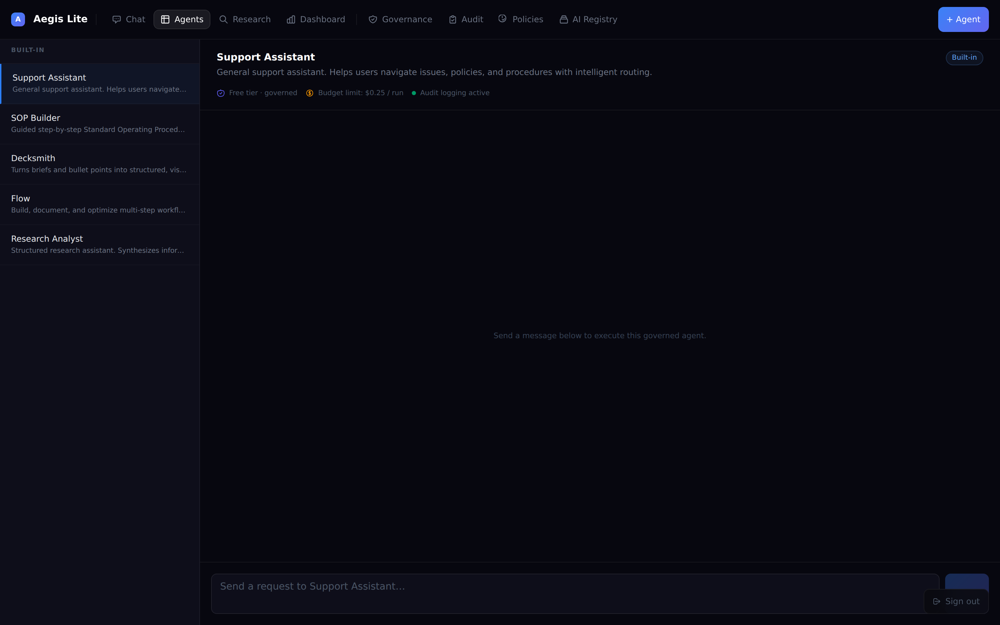
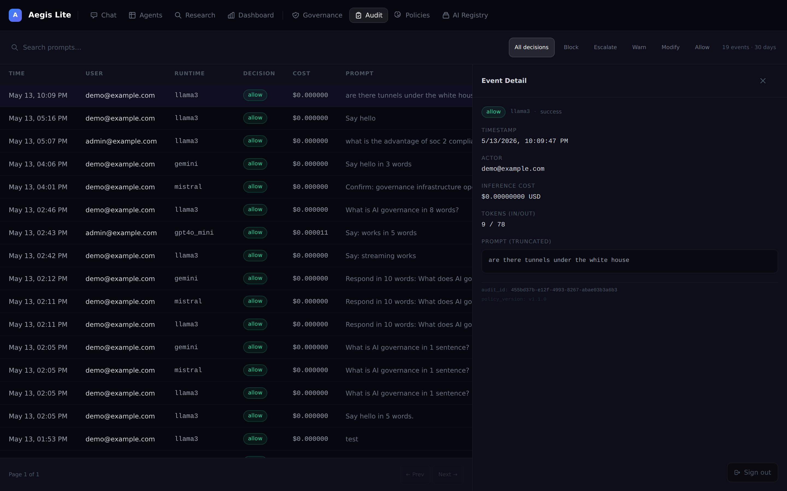

<div align="center">


# Aegis Lite

**Open-source AI governance layer for enterprise teams.**

Policy-before-inference · Real-time audit logging · Multi-provider routing · Self-hostable

[](LICENSE)
[](https://python.org)
[](https://nextjs.org)
[](https://fastapi.tiangolo.com)
[](https://github.com/jesseboudreau80/aegis-lite/issues)

**[Live Demo](https://aegis-lite.jesseboudreau.com)** · **[About](https://aegis-lite.jesseboudreau.com/about)** · **[Quick Start](#quick-start)** · **[Architecture](#architecture)** · **[Policy Engine](#policy-engine)** · **[Roadmap](#roadmap)**

</div>

---

## What it does

Aegis Lite sits between your users and your AI providers — evaluating every request through a deterministic 10-rule policy engine before a single token is dispatched. It is not a wrapper. It is a control plane.

```
User prompt → [Policy Engine: 10 rules] → [AI Router] → [Provider] → [Response scan] → User
                       ↓                        ↓
               GovernanceEvent            AuditLog
               (rule trace, risk,         (model, cost, tokens,
                policy version)            policy decision)
```

**Every request produces:**
- A governance decision (`allow` / `warn` / `modify` / `escalate` / `block`)
- A risk score (0.0–1.0) and full rule trace
- An immutable audit record with model, cost, token counts, and prompt excerpt
- Real-time telemetry streamed to the governance dashboard

---

## Live demo

> **[aegis-lite.jesseboudreau.com](https://aegis-lite.jesseboudreau.com)**
>
> Login: `admin@example.com` / `demo` (admin view) · `demo@example.com` / `demo` (user view)
>
> Apache 2.0 · Self-hostable · No account required to browse

---

## Screenshots

### Governed chat with real-time policy telemetry



*Every response includes a live governance trace: rate check → policy decision → inference routing → token count. Runtime status indicators (Policy Engine, Audit Log, AI Router) are visible in the header.*

---

### Live governance control plane



*Operational dashboard for admins: governance system health, AI system registry, monthly budget tracking, token throughput, and cost ledger — all from real request activity.*

---

### Workspace orientation (onboarding)



*Sequential workspace orientation guide walks new users through governed chat, agents, research, and telemetry monitoring. Auto-advances when the suggested page is visited.*

---

### Governed agent execution



*Built-in agents run with enforced model allowlists, per-run budget limits, and full audit logging on every execution. "Free tier · governed · Budget limit: $0.25 / run" is visible.*

---

### Audit log explorer



*Filterable audit log with decision filter chips, prompt search, cost column, and event detail panel. Every AI interaction in the workspace is recorded here.*

---

## What you can test on the live demo

| Interaction | What to observe |
|---|---|
| **Governed chat** | Send any message → watch the 4-step governance trace appear below the response |
| **Policy enforcement** | Send `My SSN is 123-45-6789` → red enforcement banner, no inference dispatched |
| **Streaming inference** | Watch tokens arrive one-by-one with live cursor during generation |
| **Runtime routing** | Change model selector → routing decision logs to audit trail |
| **Voice input** | Click microphone → speak → editable transcript before send |
| **File attachment** | Drag a `.txt` or `.csv` → client-side governance scan, then backend policy check |
| **Audit telemetry** | After 3+ requests: visit `/governance/audit` to see full decision log |
| **Agent execution** | Run the "Research Analyst" agent → governed inference with budget enforcement |
| **Activity feed** | Dashboard → policy activity feed updates live via SSE stream |

---

## What's included

| Feature | Description | Status |
|---|---|---|
| **Policy Engine** | 10-rule deterministic chain. Zero LLM calls inside evaluation. | ✅ |
| **Governed Chat** | Streaming inference with real-time governance trace | ✅ |
| **Governed Agents** | Pre-built agents with model allowlists, budget limits, audit logs | ✅ |
| **Governed Research** | Web-grounded research (Perplexity) with pre-dispatch classification | ✅ |
| **Multi-provider Routing** | OpenRouter (free), Anthropic, OpenAI, Perplexity — budget-aware fallback | ✅ |
| **Audit Log** | Every request: model, cost, tokens, policy decision, risk score | ✅ |
| **Live Activity Feed** | SSE-based real-time governance event stream | ✅ |
| **Usage Ledger** | Per-user cost tracking, monthly budgets, admin override | ✅ |
| **AI System Registry** | Register AI systems with department, risk level, model policy | ✅ |
| **Voice Input** | Browser-native transcription, governance-evaluated before dispatch | ✅ |
| **File Attachments** | Client-side scan + backend policy enforcement on attachment content | ✅ |
| **Onboarding Guide** | Sequential workspace orientation for new users | ✅ |

---

## Quick Start

### Prerequisites
- Python 3.11+
- Node.js 18+
- An [OpenRouter](https://openrouter.ai) API key (free tier — no billing required)

### 1. Clone and configure

```bash
git clone https://github.com/jesseboudreau80/aegis-lite.git
cd aegis-lite

# Backend
cp backend/.env.example backend/.env
# Edit backend/.env — minimum required:
#   SECRET_KEY=$(openssl rand -hex 32)
#   OPENROUTER_API_KEY=sk-or-v1-...    # free at openrouter.ai
```

### 2. Install dependencies

```bash
# Backend
cd backend
python3 -m venv .venv && source .venv/bin/activate
pip install -r requirements.txt

# Frontend (new terminal)
cd frontend
npm install
```

### 3. Start the development servers

```bash
# Backend (from backend/)
uvicorn main:app --reload --port 8107

# Frontend (from frontend/)
API_URL=http://127.0.0.1:8107 npm run dev
```

Open [http://localhost:3000](http://localhost:3000).

**Demo credentials (seeded on first start):**
- Admin: `admin@example.com` / `demo` — full governance dashboard, audit log, user management
- User: `demo@example.com` / `demo` — governed workspace, chat, agents, research

### Using the production start script

```bash
./start.sh   # starts backend on :8107, frontend on :3007
./stop.sh    # clean shutdown
```

---

## Architecture

```
aegis-lite/
├── backend/
│   ├── main.py                    # FastAPI app, lifespan, CORS, JWT middleware
│   ├── models.py                  # SQLAlchemy ORM: User, AuditLog, GovernanceEvent, ...
│   ├── config/
│   │   ├── policy_config.py       # Rule thresholds, data tiers, model allowlists
│   │   ├── model_registry.py      # Single source of truth for all model metadata
│   │   └── settings.py            # Pydantic settings (reads from .env)
│   ├── services/
│   │   ├── policy_engine.py       # 10-rule deterministic evaluation chain
│   │   ├── ai_router.py           # Provider dispatch with policy integration
│   │   ├── routing_engine.py      # Budget-aware model selection
│   │   ├── cost_engine.py         # Per-token cost tracking
│   │   ├── trace_builder.py       # Execution trace for governance UI
│   │   └── providers/
│   │       ├── openrouter.py      # OpenRouter (streaming + non-streaming)
│   │       └── perplexity.py      # Perplexity (web-grounded research)
│   └── routes/
│       ├── chat.py                # POST /chat, POST /chat/stream (SSE)
│       ├── governance.py          # Activity feed, SSE stream, audit explorer
│       ├── research.py            # Web research with policy enforcement
│       └── agents.py              # Agent CRUD + governed execution
└── frontend/
    ├── app/
    │   ├── chat/page.tsx          # Streaming governed chat + multimodal input
    │   ├── dashboard/page.tsx     # Live governance control plane
    │   ├── governance/            # Audit, policies, AI registry
    │   ├── about/page.tsx         # Project mission and governance philosophy
    │   ├── privacy/page.tsx       # Privacy policy
    │   └── terms/page.tsx         # Terms of use
    └── components/
        ├── OnboardingGuide.tsx    # Sequential workspace orientation
        └── RuntimeStatus.tsx      # Live provider health indicators
```

---

## Policy Engine

The policy engine is **deterministic** — no LLM calls, no probabilistic decisions. Every request is evaluated through 10 ordered rule checks:

| # | Rule | Triggers when |
|---|---|---|
| 1 | **Rate limit** | Per-user daily cap for requested model exceeded |
| 2 | **Model access** | Role-based model allowlist violation |
| 3 | **Agent permissions** | Agent model allowlist not satisfied |
| 4 | **Data classification** | Content tier incompatible with provider data policy |
| 5 | **PII detection** | SSN, credit card, email patterns in prompt |
| 6 | **Prompt injection** | 21-pattern jailbreak / override detection |
| 7 | **Keyword blocklist** | Configurable topic restrictions |
| 8 | **Research outbound** | Classification blocks external research dispatch |
| 9 | **Tool grants** | Capability verification for agent tool usage |
| 10 | **Risk controls** | Cumulative risk score threshold (block ≥ 0.85) |

**Decisions:** `allow` · `warn` · `modify` · `escalate` · `block`

**Risk scoring:** cumulative 0.0–1.0 · `warn ≥ 0.25` · `escalate ≥ 0.60` · `block ≥ 0.85`

Every decision is logged to `GovernanceEvent` with the full rule trace, risk score, and policy version.

---

## Streaming Inference

Chat responses stream token-by-token via SSE. Governance metadata is emitted before inference begins:

```
POST /chat/stream

→ data: {"type":"meta","policy_decision":"allow","execution_trace":[...],"model":"llama3"}
→ data: {"type":"token","content":"A policy engine"}
→ data: {"type":"token","content":" evaluates..."}
...
→ data: {"type":"done","message_id":"...","cost_info":{...},"execution_trace":[...]}
```

The frontend renders tokens incrementally alongside a live governance trace. A "Stop generation" button is shown during active streaming.

---

## Environment Variables

See [`backend/.env.example`](backend/.env.example) for the full annotated reference.

**Minimum required:**
```bash
SECRET_KEY=<openssl rand -hex 32>
OPENROUTER_API_KEY=<your key>     # free tier at openrouter.ai
```

**Optional providers (Aegis falls back to free OpenRouter models when unset):**
```bash
ANTHROPIC_API_KEY=    # Claude Sonnet / Opus
OPENAI_API_KEY=       # GPT-4o / GPT-4o Mini
PERPLEXITY_API_KEY=   # Web-grounded research (/research page)
```

**Production flags:**
```bash
DEMO_MODE=true        # Seed demo users on startup
LOCAL_DEV=false       # Must be false in production (disables auth bypass)
```

---

## API Reference

| Endpoint | Auth | Description |
|---|---|---|
| `POST /auth/login` | — | Password login, returns JWT |
| `POST /auth/magic-link` | — | Request email magic link |
| `POST /chat` | JWT | Governed inference (blocking response) |
| `POST /chat/stream` | JWT | Governed inference (SSE streaming) |
| `POST /research` | JWT | Web-grounded governed research |
| `GET /governance/activity` | JWT | Real-time governance activity feed |
| `GET /governance/stream` | `?token=` | SSE push stream of governance events |
| `GET /governance/audit` | Admin JWT | Filterable audit log explorer |
| `GET /governance/summary` | Admin JWT | Aggregate policy metrics |
| `GET /status` | — | Public system status |
| `GET /health` | — | Liveness probe |
| `GET /models` | — | Available model registry |

---

## Good first contributions

| Issue | Description | Effort |
|---|---|---|
| [#1](https://github.com/jesseboudreau80/aegis-lite/issues/1) | Write policy engine unit tests | Small |
| [#2](https://github.com/jesseboudreau80/aegis-lite/issues/2) | Add IBAN and UK NI number to PII detection rules | Small |
| [#5](https://github.com/jesseboudreau80/aegis-lite/issues/5) | Write Railway / Fly.io / Render deploy guides | Small |
| [#7](https://github.com/jesseboudreau80/aegis-lite/issues/7) | Improve mobile nav responsiveness | Small |
| [#11](https://github.com/jesseboudreau80/aegis-lite/issues/11) | Expand OpenRouter model catalog with newer models | Medium |
| [#15](https://github.com/jesseboudreau80/aegis-lite/issues/15) | Docker Compose dev and prod profiles | Medium |

See [CONTRIBUTING.md](CONTRIBUTING.md) for setup instructions. Issues labeled `good-first-issue` are beginner-friendly.

---

## Roadmap

| Feature | Status |
|---|---|
| Streaming governed inference | ✅ Shipped |
| File attachment governance | ✅ Shipped |
| Voice input (browser transcription) | ✅ Shipped |
| Live SSE governance event feed | ✅ Shipped |
| Policy engine unit test suite | 🚧 In progress (`#1`) |
| Docker Compose production setup | 🚧 In progress (`#15`) |
| Agent orchestration (multi-step) | 📋 Planned |
| Governed vector search / RAG | 📋 Planned |
| Image/document OCR governance | 📋 Planned |
| SAML/OIDC SSO | 📋 Planned |
| Webhook governance events | 📋 Planned |

---

## Contributing

```bash
# Fork and clone
git clone https://github.com/YOUR_USERNAME/aegis-lite.git
cd aegis-lite/backend
python3 -m venv .venv && source .venv/bin/activate
pip install -r requirements.txt
cp .env.example .env
# Add OPENROUTER_API_KEY and set LOCAL_DEV=true for development
uvicorn main:app --reload --port 8107
```

See [CONTRIBUTING.md](CONTRIBUTING.md) for the full guide. Open [GitHub Discussions](https://github.com/jesseboudreau80/aegis-lite/discussions) to propose features or ask questions.

---

## License

Apache 2.0 — see [LICENSE](LICENSE).

---

<div align="center">

Built by [Jesse Boudreau](https://github.com/jesseboudreau80) · Extracted from the enterprise [Aegis AI](https://aegis.jesseboudreau.com) governance platform

[Live Demo](https://aegis-lite.jesseboudreau.com) · [About](https://aegis-lite.jesseboudreau.com/about) · [Issues](https://github.com/jesseboudreau80/aegis-lite/issues) · [Discussions](https://github.com/jesseboudreau80/aegis-lite/discussions)

</div>
